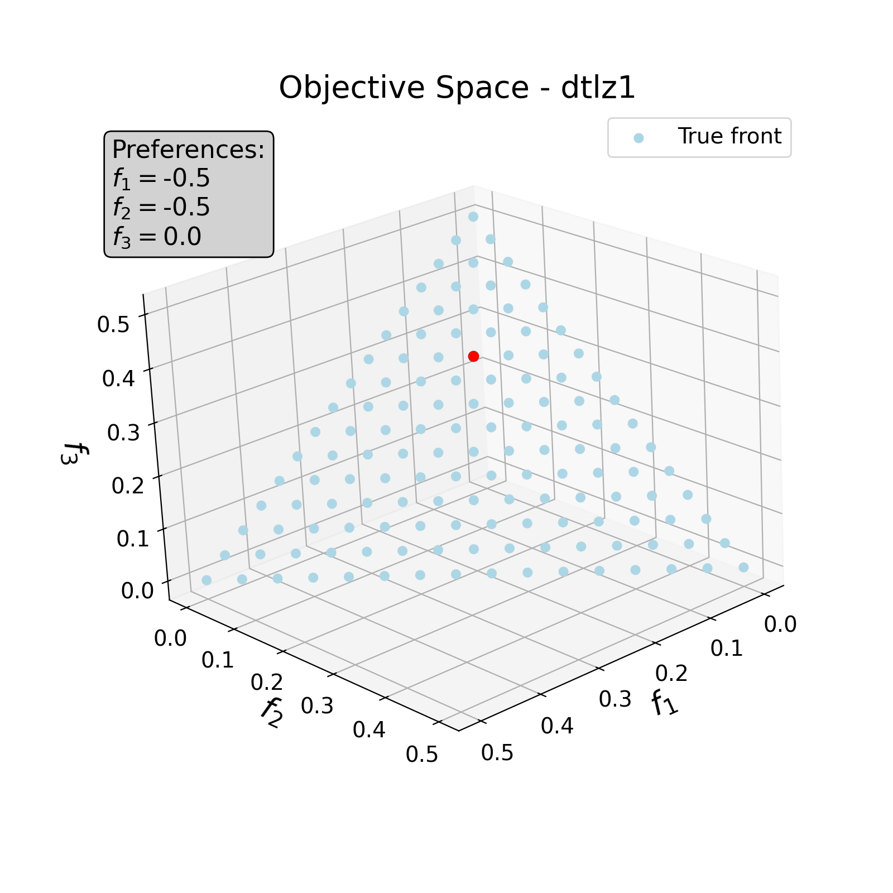
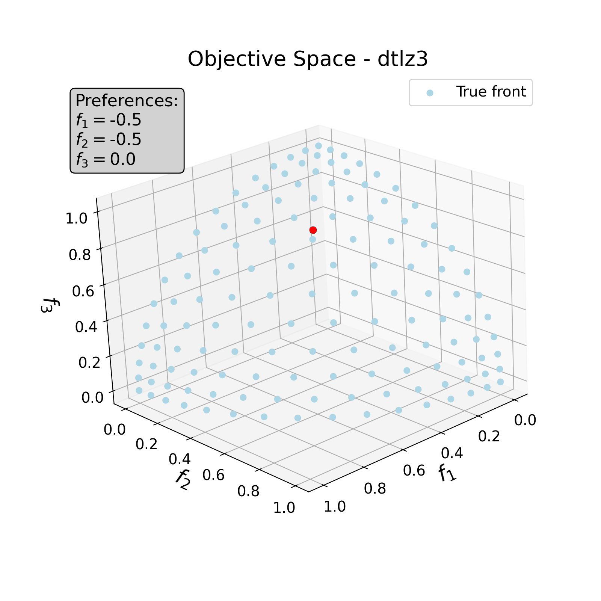
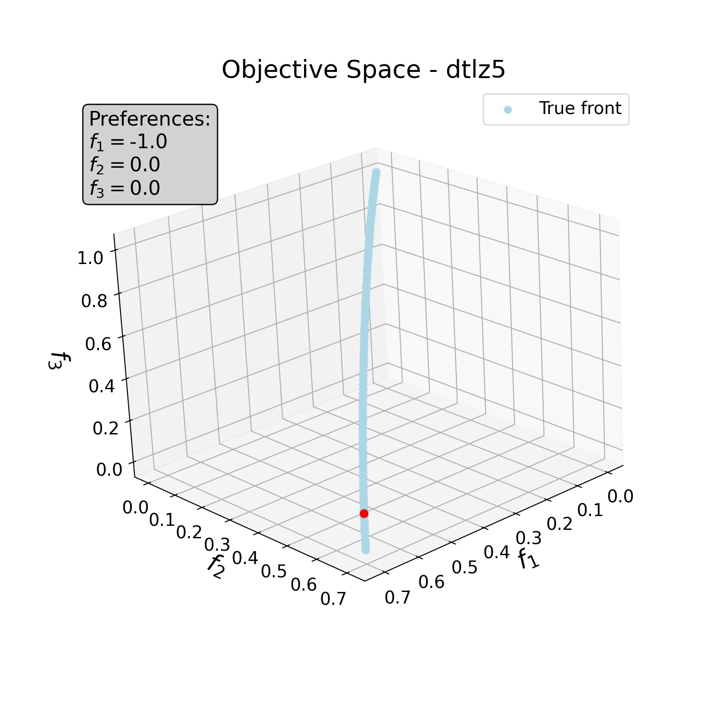

# PPE
This respository contains the Preference Pareto Exploration algorithm using the predictor-corrector approach of Continuation method described in our paper "**Interactive Pareto navigation for deep multi-task learning**"

<table style="width: 50%; border: none;">
  <tr style="border: none;">
    <td style="width: 33.33%; border: none; text-align: center;">
      
    </td>
    <td style="width: 33.33%; border: none; text-align: center;">
      
    </td>
    <td style="width: 33.33%; border: none; text-align: center;">
      
    </td>
  </tr>
</table>


## General descriptions
| Name | Type | Description |
|----------|----------|----------|
| Data    | folder     | Contains all experimental data used for testing the PPE together with all all loading and transformation applied.      |
| model_path   | folder    | models saved during training.     |
|ParetoMTL | folder | Contains the ParetoMTL framework used for comparison.  |
|plots | folder | Contains the .py files for visualizing the results of the multitask datasets saved in the ```Results``` folder  |
| Results    | folder     | Saved pickle files containing optimal points for later visualization.     |
| src  | folder  | Contains functions and models used for the PPE framework for multitask problems.  | 
| toyEx_code | folder  | The PPE implementation for toy examples such as the DTLZ 1-7 and other mathematical functions.   |
|main.py | script | Run to implement the PPE for included DL problems such as 3-task MultiMNIST and 3 & 5 -task UCI census income problem.|
| ws.py | script | Contains the weighted sum implementation.|

- Download the multitask datasets, i.e., the MultiMNIST, the UCI Census 3 and 5-task datasets, into the **Data** folder by clicking here [:arrow_right: DATASET](https://doi.org/10.5281/zenodo.20623056)


## Packages
```
* Python 3.11.5
* Torch 2.2.2
* numpy 1.26.4  
```


## Toy examples (``` toyEx_code```)

This folder contains the various toy examples shown both in the main paper and also the supplementary material of the PPE paper. Each file in this folder contains the mathematical or benchmark toy problems in a notebook or .py file. 

To visualize the interactivity and Pareto navigation, the .py files should be run. For final visualization, run the ```plot_dtlz.py``` or ```plot_toy2.py``` for the benchmark or mathematical problem, respectively.


## Experiment

To run the PPE framework for the multitask datasets in ```Data```, simply run the ```main.py``` and  interactively supply the preference weights to navigate to new Pareto optimal points. 
- For example: ```main.py  --dtype UCI --num_obj 3``` loads and runs the PPE for the 3-tasks UCI Census income dataset with the already saved model for the initial optimal solution 
*(To retrain the initial point from scratch see ```util.py``` in the src folder on where to comment out)*.

For personal use, simply add your model and dataset into the ```model.py``` and ```dataLoader.py```, and ensure both your new model and data are called in the ```main.py```. Interactive visualization during navigation is only available in 3D. For more than three objectives, final visualization of all objectives can be done by loading the results and using the ```plot_uciplus.py```.

## Citation
If you find ```PPE```  helpful for your research, please cite the following paper:

```
@article{Amakor2026PPE,
  title = {Interactive Pareto navigation for deep multi-task learning},
  author = {Amakor,  Augustina C. and Sonntag,  Konstantin and Peitz,  Sebastian},
  journal={arXiv preprint arXiv:2606.19521},
  year = {2026},
}
```
